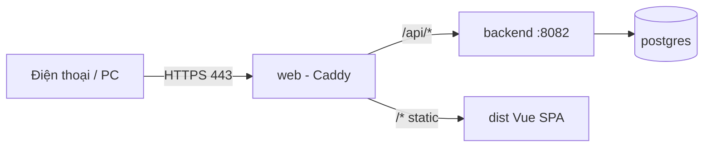

# Deploy lên server (domain + HTTPS)

**Hướng dẫn tiếng Việt chi tiết:** [HUONG-DAN-VI.md](HUONG-DAN-VI.md)

Stack: **PostgreSQL** + **Spring Boot** + **Caddy** (web tĩnh Vue + reverse proxy `/api` + chứng chỉ Let's Encrypt tự động).

Người dùng chỉ cần một URL: `https://your-domain.com` — dùng được trên điện thoại và máy tính.

## Yêu cầu server

- VPS Linux (Ubuntu 22.04+ khuyến nghị), RAM ≥ 2 GB
- Docker Engine + Compose plugin
- Domain trỏ **A record** → IP public của VPS
- Mở firewall cổng **80** và **443**

## Các bước trên VPS

### 1. Clone code

```bash
git clone <repo-url> customer-service
cd customer-service/deploy
```

### 2. Cấu hình môi trường

```bash
cp .env.example .env
nano .env
```

| Biến | Ý nghĩa |
|------|---------|
| `DOMAIN` | Domain thật, vd `app.congty.vn` |
| `ACME_EMAIL` | Email cho Let's Encrypt |
| `DB_PASSWORD` | Mật khẩu Postgres (mạnh, ngẫu nhiên) |
| `JWT_SECRET` | ≥ 32 byte hex, vd `openssl rand -hex 32` |

### 3. Chạy deploy

```bash
chmod +x deploy.sh
./deploy.sh
```

Lần đầu build image có thể mất vài phút. Caddy tự xin HTTPS khi DNS đã trỏ đúng IP.

### 4. Kiểm tra

- Mở `https://DOMAIN` trên trình duyệt điện thoại
- Đăng nhập: `admin` / `password` (đổi mật khẩu ngay trên production)

## Lệnh hữu ích

```bash
cd deploy

# Xem log
docker compose -f docker-compose.prod.yml logs -f

# Cập nhật sau khi git pull
docker compose -f docker-compose.prod.yml --env-file .env up -d --build

# Dừng
docker compose -f docker-compose.prod.yml down
```

## Kiến trúc



## Sự cố thường gặp

| Triệu chứng | Cách xử lý |
|-------------|------------|
| Không có HTTPS / certificate pending | DNS chưa trỏ đúng IP; đợi propagate; mở port 80 cho ACME |
| 502 Bad Gateway | `docker compose logs backend` — thường DB chưa sẵn sàng |
| Trang trắng sau deploy | `docker compose logs web` — kiểm tra build frontend |
| API lỗi CORS | Không nên xảy ra: FE và API cùng domain qua Caddy |

## Bảo mật production

1. Đổi mật khẩu user `admin` và `develop`
2. `JWT_SECRET` và `DB_PASSWORD` chỉ lưu trong `.env`, không commit
3. Không expose Postgres ra internet (compose không publish cổng 5432)

## Deploy từ Windows (dev) lên Linux

Chỉ cần copy repo lên VPS (`git pull` hoặc `scp`), chạy `deploy.sh` trên Linux. Docker build chạy trên server, không cần build sẵn trên máy Windows.
