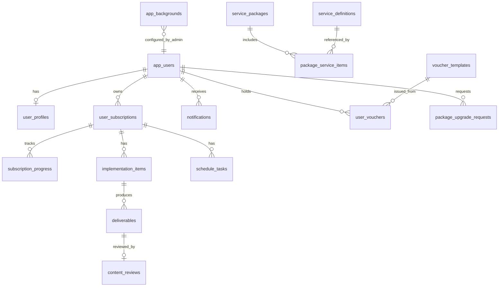

# Layla Mobile — Thiết kế DB & API theo nghiệp vụ

Tài liệu này map **note nghiệp vụ** (mockup) → **bảng DB** → **API theo màn hình** → **trạng thái code hiện tại**.

---

## 1. Tóm tắt nghiệp vụ (từ note mockup)

| Màn | Nghiệp vụ chính |
|-----|----------------|
| **Đăng nhập** | Đăng nhập JWT; nền header/body cấu hình được (admin). |
| **Tổng quan** | Gói đang dùng, % hoàn thành (bài / ảnh / video theo quota gói), danh sách dịch vụ, lịch công việc **theo ngày** (không có họp định kỳ / báo cáo tuần trên lịch). |
| **Dịch vụ** | Chi tiết gói; tab **Danh sách triển khai** (lọc Tất cả / Nội dung / QC / Báo cáo); tab **Thông tin gói**. Basic: viết bài + thiết kế ảnh. Pro: fanpage, nội dung, QC, báo cáo, ảnh bìa, like/follow. |
| **Đánh giá** | Khi xem bài/ảnh: thang **1–10**, nhận xét chi tiết, gợi ý cải thiện; điểm team Content/Design (phía công ty); gửi / lưu nháp. |
| **Thông báo** | **2 chiều**: phản hồi công ty, khuyến mãi, nhắc lịch. |
| **Tài khoản** | Thông tin kiểu app ngân hàng; **nâng cấp gói** (Basic → Pro); **Voucher của tôi** (sinh nhật, hạn dùng). |
| **Admin** | Quản lý user ACTIVE/INACTIVE; cấu hình theme đăng nhập. |

---

## 2. Sơ đồ quan hệ (ER)



---

## 3. Bảng dữ liệu

### 3.1 Đã có trong DB (đang chạy)

| Bảng | Mục đích | Entity / API |
|------|----------|--------------|
| `app_users` | Tài khoản, role ADMIN/USER, ACTIVE/INACTIVE | `AppUser.java` |
| `app_backgrounds` | URL nền login (LOGIN_HEADER, LOGIN_BODY) | `AppBackground.java` |
| `customers` | CRM cũ (màn `/customers`) | `CustomerEntity.java` |

### 3.2 Master data — Gói & dịch vụ

```sql
-- File đầy đủ: backend/src/main/resources/db/schema-mobile-app.sql

service_packages       -- BASIC_15, PRO_15, BASIC_30, PRO_30 + quota
service_definitions    -- fanpage, content, posts, design, ...
package_service_items  -- gói nào gồm dịch vụ nào
```

**Gói Basic:** `posts`, `design`  
**Gói Pro:** `fanpage`, `content`, `ads`, `report`, `cover`, `like`

### 3.3 Gói đang dùng của khách

```sql
user_subscriptions (
  id, user_id, package_code, status,  -- ACTIVE | EXPIRED | CANCELLED
  start_date, end_date,
  display_title,                      -- vd: "Chăm sóc Fanpage Pro"
  created_at, updated_at
)

subscription_progress (
  subscription_id PK,
  completed_posts, completed_images, completed_videos
)
```

### 3.4 Màn Dịch vụ — Triển khai

```sql
implementation_items (
  id, subscription_id,
  code,                             -- design_post, seo_content, ...
  category,                         -- content | ads | report
  title,                            -- hiển thị (hoặc i18n key)
  current_count, target_count,
  status,                           -- approved | in_progress | waiting_feedback
  sort_order, updated_on
)
```

Map với `IMPLEMENTATION_TASKS` trong `frontend/src/config/appScreenConfig.js`.

### 3.5 Màn Đánh giá — Bài gửi khách duyệt

```sql
deliverables (
  id, implementation_item_id, subscription_id,
  post_number,                      -- "1256"
  thumbnail_url, preview_url,
  team_content_score, team_design_score,  -- 0..10, do team nhập
  company_response_status,          -- responded | pending
  published_at
)

content_reviews (
  id, deliverable_id, user_id,
  quality_score,                    -- 1..10
  comments, suggestions,
  status,                           -- DRAFT | SUBMITTED
  submitted_at, created_at, updated_at
)
```

- Một deliverable / user: tối đa 1 review SUBMITTED; nhiều DRAFT → ghi đè hoặc 1 draft/user.
- **Lưu nháp** hiện FE dùng `localStorage` → API: `PUT .../reviews/draft`.

### 3.6 Màn Tổng quan — Lịch ngày

```sql
schedule_tasks (
  id, subscription_id,
  task_date, title, scheduled_time,   -- chỉ việc trong ngày
  sort_order
)
```

Không lưu “cuộc họp định kỳ” / “báo cáo tuần” trên lịch (theo yêu cầu product).

### 3.7 Màn Thông báo

```sql
notifications (
  id, user_id,
  type,                             -- FEEDBACK_REPLY | PROMOTION | SCHEDULE
  title, body,
  reference_type, reference_id,     -- deliverable, schedule_task, ...
  read_at, created_at
)
```

Hai chiều: admin/ops tạo bản ghi → khách đọc; sau có thể thêm `notification_replies`.

### 3.8 Màn Tài khoản

```sql
user_profiles (
  user_id PK,
  full_name, phone, email, avatar_url,
  updated_at
)

package_upgrade_requests (
  id, user_id,
  from_package_code, to_package_code,
  status,                           -- PENDING | APPROVED | REJECTED
  note, created_at
)

voucher_templates (
  id, code_prefix, title, description,
  valid_days, tier_required
)

user_vouchers (
  id, user_id, template_id,
  code, title, expires_at, used_at, created_at
)
```

---

## 4. API theo màn hình

Base: `http://localhost:8082`  
Auth: `Authorization: Bearer <JWT>` (trừ login, GET theme).

Chi tiết OpenAPI: `backend/src/main/resources/openapi/mobile-api.yaml`

### 4.1 Đăng nhập — `LoginView.vue`

| Method | Path | Mô tả | Code |
|--------|------|--------|------|
| GET | `/api/v1/content` | `headerBackgroundUrl`, `bodyBackgroundUrl` | ✅ BE + FE |
| POST | `/api/v1/auth/login` | JWT | ✅ |
| POST | `/api/v1/auth/register` | Đăng ký | ✅ |
| POST | `/api/v1/content` | Admin lưu theme | ✅ |

**FE:** `ContentService.getLoginTheme()`, `LoginView.vue` — load theme, redirect `/home`.

---

### 4.2 Tổng quan — `HomeView.vue`

| Method | Path | Response chính | Code |
|--------|------|----------------|------|
| GET | `/api/v1/mobile/home` | `subscription`, `progress` (% + counts), `services[]`, `schedule` (tuần + tasks ngày chọn) | ✅ `MobileHomeService` + FE `mobileApi.js` |

**Query gợi ý:** `?weekStart=2024-06-10&selectedDate=2024-06-12`

**FE map:**
- `packageCard` ← `subscription`
- `overallProgress` ← `progress.overallPercent`
- `serviceList` ← `services[]`
- `schedule` ← `schedule.weekDays`, `schedule.tasks`

---

### 4.3 Dịch vụ — `ServicesView.vue`

| Method | Path | Response chính | Code |
|--------|------|----------------|------|
| GET | `/api/v1/mobile/services` | `activeSubscription`, `implementationItems[]`, `packageServices[]` (thông tin gói) | ✅ `MobileServicesService` + FE |

**Query:** `?category=all|content|ads|report` (lọc server-side hoặc client).

**FE map:**
- Thẻ gói ← `activeSubscription`
- Tab triển khai ← `implementationItems`
- Tab thông tin gói ← `packageServices`
- Click item content → `/services/review/:taskId` nếu có `deliverableId`

---

### 4.4 Đánh giá — `ServiceReviewView.vue`

| Method | Path | Mô tả | Code |
|--------|------|--------|------|
| GET | `/api/v1/mobile/deliverables/{deliverableId}/review` | Post, thumbnail, team scores, draft/submitted review | ✅ `MobileReviewService` + FE |
| PUT | `/api/v1/mobile/deliverables/{id}/reviews/draft` | Lưu nháp | ✅ DB `content_reviews` |
| POST | `/api/v1/mobile/deliverables/{id}/reviews` | Gửi đánh giá | ✅ |

**Đổi route đề xuất:** `/services/review/:deliverableId` (UUID) thay `taskId` string khi nối API.

---

### 4.5 Thông báo — `NotificationsView.vue`

| Method | Path | Mô tả | Code |
|--------|------|--------|------|
| GET | `/api/v1/mobile/notifications` | Danh sách, phân trang | ✅ `MobileNotificationService` |
| PATCH | `/api/v1/mobile/notifications/{id}/read` | Đánh dấu đã đọc | ✅ |
| GET | `/api/v1/mobile/notifications/unread-count` | Badge chuông | ✅ `HomeView` |

---

### 4.6 Tài khoản — `AccountView.vue`

| Method | Path | Mô tả | Code |
|--------|------|--------|------|
| GET | `/api/v1/mobile/account` | Profile + subscription tóm tắt | ✅ `AccountView` |
| PATCH | `/api/v1/mobile/account` | Cập nhật họ tên, SĐT, avatar | ✅ |
| GET | `/api/v1/mobile/packages` | Catalog để nâng cấp | ✅ |
| POST | `/api/v1/mobile/package-upgrade-requests` | Yêu cầu nâng cấp | ✅ |
| GET | `/api/v1/mobile/vouchers` | Voucher của tôi | ✅ |
| POST | `/api/v1/admin/users/{id}/subscription` | Admin gán gói | ✅ |

**Đăng ký mới:** `AuthService.register` tự gán gói `BASIC_15` qua `SubscriptionProvisioningService`.

**Admin gán gói:** `POST /api/v1/admin/users/{id}/subscription` body `{ "packageCode": "PRO_15", "displayTitle": "...", "startDate", "endDate" }`.

---

### 4.7 Admin

| Method | Path | Code |
|--------|------|------|
| GET/POST/PUT | `/api/v1/admin/users` | ✅ |
| GET/POST | `/api/v1/content` | ✅ Theme |
| (tương lai) | `/api/v1/admin/subscriptions` | Gán gói cho user |
| (tương lai) | `/api/v1/admin/notifications` | Gửi thông báo / phản hồi |

---

## 5. Map file frontend ↔ API

| File | Vai trò | Nguồn dữ liệu hiện tại |
|------|---------|-------------------------|
| `config/appScreenConfig.js` | Master gói, task, review demo | Static — **thay bằng API** |
| `composables/useAppScreen.js` | State chung các màn mobile | Ref + `localStorage` gói |
| `views/LoginView.vue` | Login + theme | API ✅ theme, auth ✅ |
| `views/HomeView.vue` | Tổng quan | Mock |
| `views/ServicesView.vue` | Dịch vụ | Mock |
| `views/ServiceReviewView.vue` | Đánh giá | Mock + localStorage draft |
| `views/NotificationsView.vue` | Thông báo | Mock |
| `views/AccountView.vue` | Tài khoản | Mock switcher gói |
| `components/layout/MobileAppShell.vue` | Shell + bottom nav cố định | UI ✅ |
| `views/UsersAdminView.vue` | Admin users | API ✅ |
| `views/LoginThemeAdminView.vue` | Admin theme | API ✅ |

---

## 6. Map file backend ↔ API

| File | Trạng thái |
|------|------------|
| `AuthApiController`, `AuthService` | ✅ |
| `AdminUserApiController` | ✅ |
| `ContentApiController`, `LoginThemeService` | ✅ |
| `CustomerApiController` | ✅ (legacy, không dùng mobile nav) |
| `JwtAuthFilter` | Public: GET `/api/v1/content`; còn lại JWT |
| `MobileApiController`, `Mobile*Service`, entities `entity.mobile.*` | ✅ Home, Services, Review |
| `MobileSampleDataLoader` | ✅ Seed gói + subscription demo cho `admin` |

---

## 7. Thứ tự triển khai đề xuất

1. Chạy `schema-mobile-app.sql` + seed gói/dịch vụ  
2. `user_subscriptions` + GET `/mobile/home` + `/mobile/services`  
3. `deliverables` + `content_reviews` + API đánh giá  
4. `notifications`  
5. `user_profiles`, upgrade, vouchers  
6. Nối FE: tạo `MobileApiService`, bỏ dần `appScreenConfig` demo  

---

## 8. Quy ước

- **user_id** = `app_users.id` (UUID string).  
- Mọi API `/api/v1/mobile/*` chỉ trả dữ liệu của user đang đăng nhập (trừ ADMIN tooling).  
- **i18n:** API trả `title` plain text hoặc `titleKey` + FE dịch; giai đoạn 1 nên trả text tiếng Việt từ DB.  
- **Trạng thái implementation_item** đồng bộ với FE: `approved` \| `in_progress` \| `waiting_feedback`.

---

*Tài liệu tạo theo mockup Layla + code repo `customer-service`. Cập nhật khi implement từng phase.*
